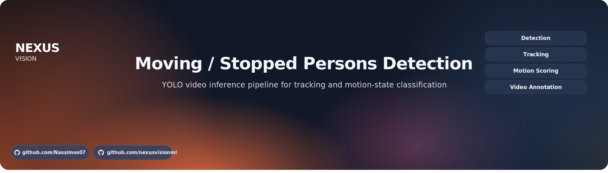

<div align="center">
  
</div>

<div align="center">

[](#-setup)
[](#-features)
[](#-features)
[](#-cli-quick-start)
[](#-setup)

</div>

<div align="center">
<span style="color:#1E90FF;"><strong>Moving-Stopped-Persons Detection</strong></span> — YOLO-based video inference for classifying tracked people as moving or stopped.
</div>
<div align="center">
Built from the original notebook workflow and refactored into a repeatable Python package with config-driven execution.
</div>
<div align="center">
Focused on inference, tracking, annotation, and reproducible local testing on sample video inputs.
</div>

---

## ✦ <span style="color:#1E90FF;">Pipeline</span>

<div align="center">Input Video → YOLO Person Detection → ByteTrack Tracking → Motion State Classification → Annotation Overlay → Output Video</div>

- **Input**: local video file, defaulting to `assets/videos/test1.mp4`
- **Detection**: YOLO model inference on person class only
- **Tracking**: ByteTrack keeps object identity across frames
- **Classification**: absolute or relative displacement marks each tracked person as processing, stopped, or moving
- **Output**: annotated video written to `outputs/`

## ✦ <span style="color:#1E90FF;">Features</span>

- Package-based refactor of the original notebook workflow
- Fire CLI for repeatable local inference runs
- Config-driven execution through `configs/default.yaml`
- Support for `relative` and `absolute` motion scoring modes
- Support for `all`, `moving`, and `stopped` output filters
- Sample video and visual assets included for quick validation
- Basic unit tests for motion-state helpers

## ✦ <span style="color:#1E90FF;">Setup</span>

### ◐ Dependencies

Create and activate a virtual environment.

```bash
python3 -m venv .venv
source .venv/bin/activate
```

Install runtime dependencies.

```bash
pip install -r requirements.txt
```

Additional parameters:
- none

Install development dependencies.

```bash
pip install -r requirements-dev.txt
```

Additional parameters:
- none

Install the package in editable mode.

```bash
pip install -e .
```

Additional parameters:
- none

### ◐ Data

- Default test video: `assets/videos/test1.mp4`
- Default model: `yolov8x.pt`
- Output directory: `outputs/`
- The first model run may download weights if they are not already present locally.
- `yolov8x` is heavy for CPU or weak GPU setups, so `yolov8n.pt` is a better quick-test option.

## ✦ <span style="color:#1E90FF;">Project Structure</span>

```text
.
├── assets/
│   ├── images/
│   └── videos/
├── configs/
│   └── default.yaml
├── notebooks/
│   └── Moving_Stopped_Persons_detection.ipynb
├── scripts/
│   └── run_demo.sh
├── src/
│   └── movement_detection/
│       ├── cli.py
│       ├── config.py
│       ├── model.py
│       ├── motion.py
│       └── pipeline.py
├── tests/
│   └── test_motion.py
├── pyproject.toml
├── requirements.txt
└── requirements-dev.txt
```

## ✦ <span style="color:#1E90FF;">CLI Quick Start</span>

Run the default relative-motion pipeline.

```bash
movement-detection run --config configs/default.yaml --mode relative --filter_mode all
```

Additional parameters:
- `--config`: path to the YAML config file
- `--mode`: `relative` or `absolute`
- `--filter_mode`: `all`, `moving`, or `stopped`

Run the demo helper script.

```bash
bash scripts/run_demo.sh
```

Additional parameters:
- edit the script if you want different CLI flags

Run unit tests for motion helpers.

```bash
PYTHONPATH=src pytest tests/test_motion.py
```

Additional parameters:
- requires dev dependencies installed

## ✦ <span style="color:#1E90FF;">Configuration</span>

Main settings in `configs/default.yaml`:
- `model_path`: YOLO weights path
- `device`: `auto`, `cpu`, or `cuda`
- `classes`: class IDs passed to YOLO inference
- `source_video`: input video path
- `output_dir`: directory for rendered outputs
- `frame_step`: frame interval used for motion comparison
- `absolute_speed_threshold`: threshold for absolute displacement mode
- `relative_speed_factor`: threshold factor for relative mode
- `trace_length`: tracking trail length
- `show`: display frames during inference
- `save_video`: enable or disable output writing

## ✦ <span style="color:#1E90FF;">Inference</span>

The current repository is built for inference only.
It does not include a training pipeline, dataset preparation flow, or experiment tracking layer yet.

## ✦ <span style="color:#1E90FF;">Results</span>

Expected output after a successful run:
- annotated video saved under `outputs/`
- motion labels per tracked person
- support for full scene view or filtered moving/stopped views

## ✦ <span style="color:#1E90FF;">Roadmap</span>

- add Docker support for reproducible runtime setup
- add CI for linting and tests
- add benchmark and metrics logging
- add richer evaluation for motion-threshold calibration
- add experiment tracking if the project expands beyond inference

## ✦ <span style="color:#1E90FF;">Contributing</span>

Use small, focused commits.
Validate the pipeline on the sample video before changing thresholds or default settings.

## ✦ <span style="color:#1E90FF;">License</span>

No explicit license file is present in the repository yet.
Add one before external distribution.
